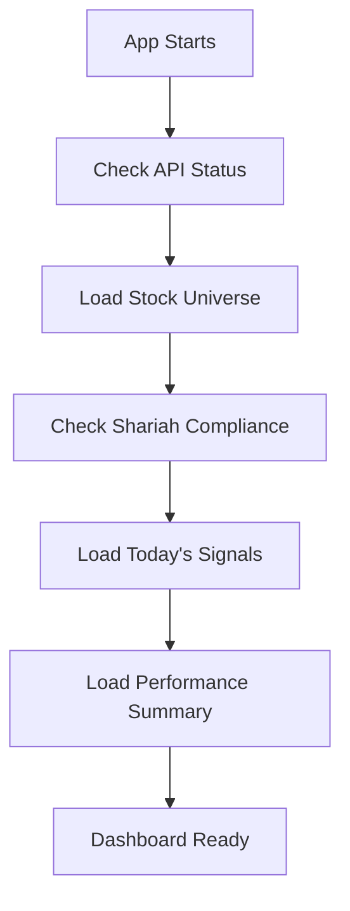
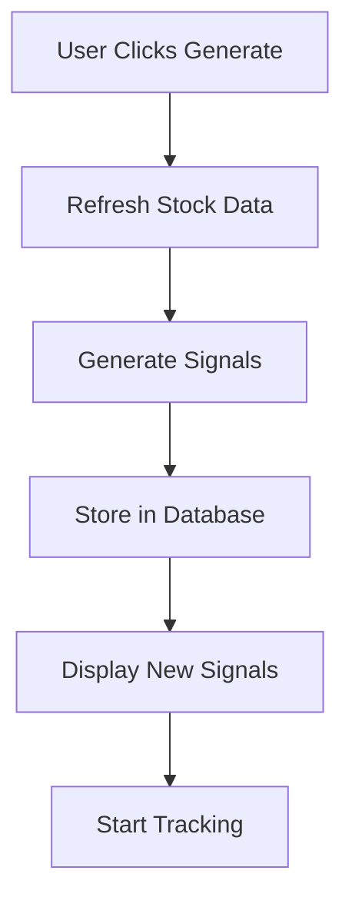
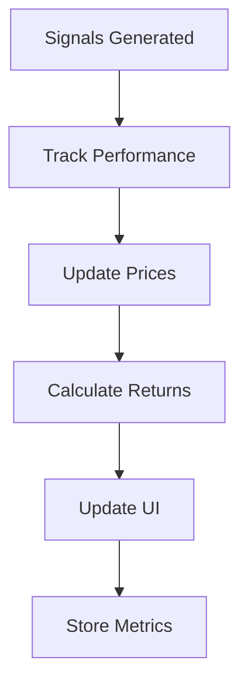
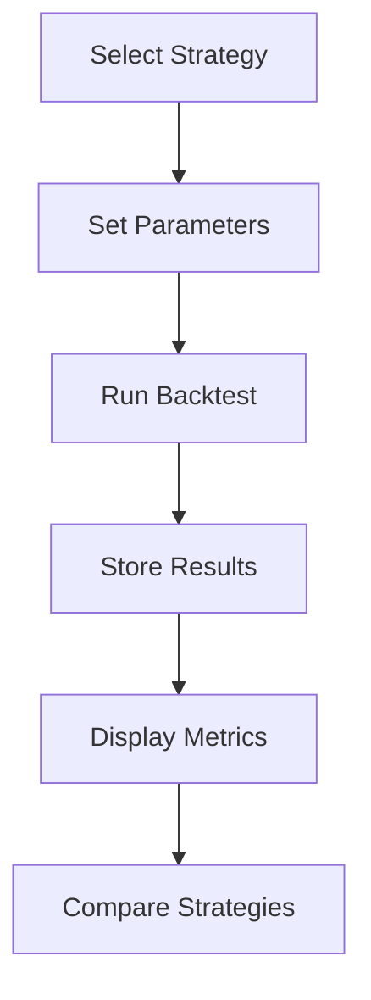

# 🔄 EmergentTrader API Flow & Usage Guide

## 📋 Overview

This guide explains the complete API flow, sequence, and how to integrate all available endpoints into your UI for a comprehensive trading platform experience.

## 🗺️ API Endpoints Map

### **Available Endpoints (11 total)**

| Endpoint | Method | Status | UI Integration | Purpose |
|----------|--------|--------|----------------|---------|
| `/` | GET | ✅ Used | Header status | API health check |
| `/stocks/all` | GET | ⚠️ Partial | Stock list view | Get all NSE stocks |
| `/stocks/refresh` | POST | ❌ Not used | Refresh button | Update stock prices |
| `/stocks/shariah` | GET | ⚠️ Partial | Shariah filter | Get compliant stocks |
| `/signals/generate` | POST | ✅ Used | Generate button | Create new signals |
| `/signals/today` | GET | ✅ Used | Dashboard view | Today's signals |
| `/signals/open` | GET | ❌ Not used | Active signals tab | Open positions |
| `/signals/track` | POST | ❌ Not used | Performance tracking | Track signal results |
| `/backtest` | POST | ✅ Used | Backtest tab | Strategy testing |
| `/performance/summary` | GET | ❌ Not used | Analytics dashboard | Performance metrics |
| `/report/send` | POST | ❌ Not used | Report generation | Email reports |

## 🔄 Complete API Flow Sequence

### **1. Application Initialization Flow**



**Implementation Sequence:**
```javascript
// 1. Check API health
const healthCheck = await fetch('/api/')

// 2. Load stock universe
const stocksResponse = await fetch('/api/stocks/all')

// 3. Get Shariah-compliant stocks
const shariahResponse = await fetch('/api/stocks/shariah')

// 4. Load existing signals
const signalsResponse = await fetch('/api/signals/today')

// 5. Get performance summary
const performanceResponse = await fetch('/api/performance/summary')
```

### **2. Trading Signal Generation Flow**



**Implementation:**
```javascript
const generateTradingSignals = async () => {
  // 1. Refresh stock data first
  await fetch('/api/stocks/refresh', { method: 'POST' })
  
  // 2. Generate signals
  const response = await fetch('/api/signals/generate', {
    method: 'POST',
    body: JSON.stringify({
      strategy: 'momentum',
      shariah_only: true,
      min_confidence: 0.6
    })
  })
  
  // 3. Start tracking the new signals
  const signals = response.data.signals
  if (signals.length > 0) {
    await trackSignals(signals.map(s => s.signal_id))
  }
}
```

### **3. Signal Tracking & Performance Flow**



**Implementation:**
```javascript
const trackSignalPerformance = async (signalIds) => {
  // Track specific signals
  const response = await fetch('/api/signals/track', {
    method: 'POST',
    body: JSON.stringify({
      signal_ids: signalIds,
      update_prices: true
    })
  })
  
  // Update performance summary
  const performance = await fetch('/api/performance/summary')
  updatePerformanceDashboard(performance.data)
}
```

### **4. Backtesting Flow**



## 🎯 Missing UI Components & Implementation

### **1. Stock Management Dashboard**

**Missing Features:**
- Stock universe viewer
- Real-time price updates
- Shariah compliance filter
- Sector analysis

**Implementation:**
```javascript
// Stock Management Component
const StockDashboard = () => {
  const [stocks, setStocks] = useState([])
  const [shariahOnly, setShariahOnly] = useState(false)
  
  const loadStocks = async () => {
    const endpoint = shariahOnly ? '/api/stocks/shariah' : '/api/stocks/all'
    const response = await fetch(endpoint)
    setStocks(response.data.stocks)
  }
  
  const refreshPrices = async () => {
    await fetch('/api/stocks/refresh', { method: 'POST' })
    loadStocks() // Reload with updated prices
  }
  
  return (
    <div>
      <button onClick={refreshPrices}>Refresh Prices</button>
      <toggle onChange={setShariahOnly}>Shariah Only</toggle>
      <StockTable stocks={stocks} />
    </div>
  )
}
```

### **2. Active Signals Management**

**Missing Features:**
- Open positions view
- Signal performance tracking
- Real-time P&L updates

**Implementation:**
```javascript
// Active Signals Component
const ActiveSignals = () => {
  const [openSignals, setOpenSignals] = useState([])
  const [tracking, setTracking] = useState({})
  
  const loadOpenSignals = async () => {
    const response = await fetch('/api/signals/open')
    setOpenSignals(response.data.signals)
    
    // Start tracking all open signals
    const signalIds = response.data.signals.map(s => s.signal_id)
    trackSignals(signalIds)
  }
  
  const trackSignals = async (signalIds) => {
    const response = await fetch('/api/signals/track', {
      method: 'POST',
      body: JSON.stringify({ signal_ids: signalIds })
    })
    setTracking(response.data.results)
  }
  
  return (
    <div>
      <h2>Active Positions</h2>
      {openSignals.map(signal => (
        <SignalCard 
          key={signal.signal_id}
          signal={signal}
          performance={tracking[signal.signal_id]}
        />
      ))}
    </div>
  )
}
```

### **3. Performance Analytics Dashboard**

**Missing Features:**
- Comprehensive performance metrics
- Strategy comparison
- Risk analytics

**Implementation:**
```javascript
// Performance Dashboard Component
const PerformanceDashboard = () => {
  const [performance, setPerformance] = useState(null)
  const [period, setPeriod] = useState('30d')
  
  const loadPerformance = async () => {
    const response = await fetch(`/api/performance/summary?period=${period}`)
    setPerformance(response.data)
  }
  
  return (
    <div>
      <PeriodSelector value={period} onChange={setPeriod} />
      <MetricsGrid performance={performance} />
      <PerformanceCharts data={performance} />
    </div>
  )
}
```

### **4. Automated Reporting System**

**Missing Features:**
- Daily/weekly reports
- Email notifications
- Performance summaries

**Implementation:**
```javascript
// Reporting Component
const ReportingSystem = () => {
  const sendDailyReport = async () => {
    await fetch('/api/report/send', {
      method: 'POST',
      body: JSON.stringify({
        type: 'daily',
        email: 'user@example.com',
        include_performance: true,
        include_signals: true
      })
    })
  }
  
  return (
    <div>
      <button onClick={sendDailyReport}>Send Daily Report</button>
      <ReportScheduler />
    </div>
  )
}
```

## 🔄 Recommended API Usage Patterns

### **1. Real-time Updates Pattern**

```javascript
// Implement polling for real-time updates
const useRealTimeUpdates = () => {
  useEffect(() => {
    const interval = setInterval(async () => {
      // Update stock prices
      await fetch('/api/stocks/refresh', { method: 'POST' })
      
      // Update signal tracking
      const openSignals = await fetch('/api/signals/open')
      if (openSignals.data.signals.length > 0) {
        const signalIds = openSignals.data.signals.map(s => s.signal_id)
        await fetch('/api/signals/track', {
          method: 'POST',
          body: JSON.stringify({ signal_ids: signalIds })
        })
      }
      
      // Update performance metrics
      await fetch('/api/performance/summary')
    }, 30000) // Every 30 seconds
    
    return () => clearInterval(interval)
  }, [])
}
```

### **2. Error Handling Pattern**

```javascript
const apiCall = async (endpoint, options = {}) => {
  try {
    const response = await fetch(endpoint, options)
    const data = await response.json()
    
    if (!data.success) {
      throw new Error(data.error)
    }
    
    return data
  } catch (error) {
    console.error(`API Error (${endpoint}):`, error)
    // Show user-friendly error message
    showNotification('error', error.message)
    throw error
  }
}
```

### **3. Caching Pattern**

```javascript
const useApiCache = () => {
  const cache = useRef(new Map())
  
  const cachedFetch = async (endpoint, ttl = 60000) => {
    const cached = cache.current.get(endpoint)
    
    if (cached && Date.now() - cached.timestamp < ttl) {
      return cached.data
    }
    
    const data = await fetch(endpoint).then(r => r.json())
    cache.current.set(endpoint, {
      data,
      timestamp: Date.now()
    })
    
    return data
  }
  
  return cachedFetch
}
```

## 🎯 Complete UI Enhancement Plan

### **Phase 1: Core Missing Features**
1. **Stock Management Tab**
   - All stocks view with real-time prices
   - Shariah filter toggle
   - Refresh prices button
   - Sector breakdown

2. **Active Signals Tab**
   - Open positions view
   - Real-time P&L tracking
   - Signal performance metrics
   - Close position functionality

3. **Performance Analytics Tab**
   - Comprehensive metrics dashboard
   - Strategy comparison charts
   - Risk analytics
   - Historical performance

### **Phase 2: Advanced Features**
1. **Real-time Updates**
   - WebSocket integration
   - Live price feeds
   - Instant signal updates

2. **Automated Reporting**
   - Daily/weekly email reports
   - Performance summaries
   - Alert notifications

3. **Advanced Analytics**
   - Portfolio optimization
   - Risk management tools
   - Correlation analysis

### **Phase 3: User Experience**
1. **Customizable Dashboard**
   - Drag-and-drop widgets
   - Personal preferences
   - Custom alerts

2. **Mobile Optimization**
   - Responsive design
   - Touch-friendly interface
   - Offline capabilities

## 🚀 Implementation Priority

### **High Priority (Immediate)**
1. ✅ Stock refresh functionality
2. ✅ Active signals tracking
3. ✅ Performance summary dashboard
4. ✅ Real-time signal updates

### **Medium Priority (Next Sprint)**
1. 📊 Advanced analytics
2. 📧 Automated reporting
3. 🔄 Real-time data feeds
4. 📱 Mobile optimization

### **Low Priority (Future)**
1. 🤖 AI-powered insights
2. 📈 Advanced charting
3. 🔗 External integrations
4. 👥 Multi-user support

## 📝 Next Steps

1. **Implement missing UI components** for unused APIs
2. **Add real-time updates** with proper polling/WebSocket
3. **Create comprehensive dashboard** with all metrics
4. **Add error handling** and loading states
5. **Implement caching** for better performance
6. **Add automated testing** for API flows

Your API infrastructure is solid - now it's time to build the complete UI experience that leverages all these powerful endpoints! 🚀
