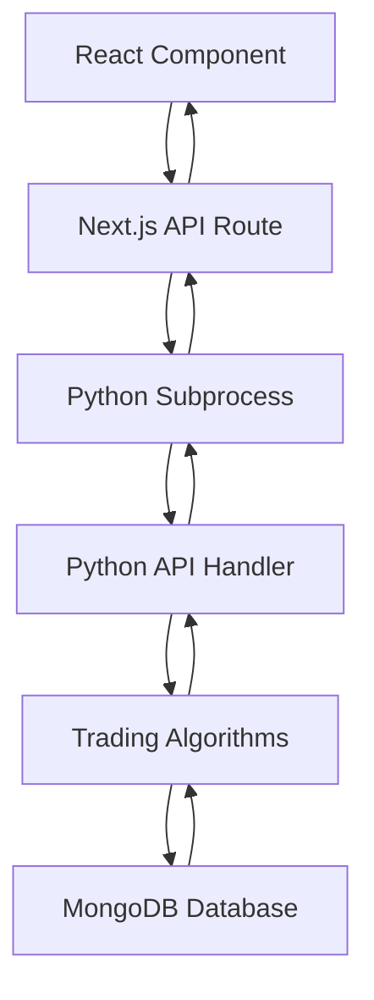

# 🏗️ EmergentTrader Project Structure & Python Integration

## 📋 Overview

EmergentTrader is a **hybrid Next.js + Python application** that combines the power of React/Next.js for the frontend with Python's data science capabilities for trading algorithms. Here's how the architecture works:

```
Next.js Frontend ↔ Next.js API Routes ↔ Python Backend ↔ MongoDB Database
```

## 🗂️ Complete Project Structure

```
emergentTrader/
├── 📁 Frontend (Next.js)
│   ├── app/
│   │   ├── api/[[...path]]/route.js     # 🔗 Main API proxy to Python
│   │   ├── api/docs/                    # 📚 Swagger documentation
│   │   ├── docs/page.js                 # 📖 API docs UI
│   │   ├── layout.js                    # 🎨 App layout
│   │   ├── page.js                      # 🏠 Main dashboard
│   │   └── globals.css                  # 🎨 Global styles
│   ├── components/
│   │   ├── EnhancedDashboard.js         # 📊 Main trading dashboard
│   │   └── ui/                          # 🧩 Reusable UI components
│   ├── hooks/                           # 🪝 React hooks
│   ├── lib/                             # 📚 Utilities & Swagger config
│   └── scripts/                         # 🛠️ Database management
│
├── 🐍 Python Backend
│   ├── python_backend/
│   │   ├── api_handler.py               # 🔌 Main API interface
│   │   ├── core/                        # 🧠 Trading algorithms
│   │   │   ├── signal_engine.py         # 📈 Signal generation
│   │   │   ├── backtest_engine.py       # 🧪 Strategy backtesting
│   │   │   ├── shariah_filter.py        # ☪️ Shariah compliance
│   │   │   └── strategies/              # 📊 Trading strategies
│   │   ├── services/                    # 🔧 External services
│   │   │   └── yfinance_fetcher.py      # 📊 Stock data fetching
│   │   ├── data/                        # 💾 Data storage
│   │   └── requirements.txt             # 📦 Python dependencies
│
├── 🗄️ Database & Config
│   ├── scripts/
│   │   ├── setup-database.js            # 🏗️ MongoDB initialization
│   │   └── db-manager.js                # 🛠️ Database management
│   ├── .env                             # ⚙️ Environment variables
│   ├── package.json                     # 📦 Node.js dependencies
│   └── next.config.js                   # ⚙️ Next.js configuration
│
└── 📚 Documentation
    ├── API_DOCUMENTATION.md             # 📖 API reference
    ├── API_FLOW_GUIDE.md               # 🔄 API usage guide
    ├── DATABASE_SETUP.md               # 🗄️ Database guide
    └── PROJECT_STRUCTURE.md            # 🏗️ This file
```

## 🔗 Python-Next.js Integration Architecture

### **How Python is Used in Next.js**

#### **1. Subprocess Integration Pattern**
```javascript
// Next.js API Route (app/api/[[...path]]/route.js)
import { spawn } from 'child_process'

async function callPythonAPI(endpoint, method = 'GET', params = {}) {
  return new Promise((resolve, reject) => {
    const pythonScript = `
import sys
import os
sys.path.append('${pythonBackendPath}')
from api_handler import handle_api_request
import json

result = handle_api_request('${endpoint}', '${method}', ${JSON.stringify(params)})
print(json.dumps(result))
`
    
    const pythonProcess = spawn('python3', ['-c', pythonScript])
    // Handle output and return JSON response
  })
}
```

#### **2. Communication Flow**


### **3. Data Flow Example**
```javascript
// Frontend Request
fetch('/api/signals/generate', {
  method: 'POST',
  body: JSON.stringify({ strategy: 'momentum' })
})

// Next.js API Route
export async function POST(request) {
  const params = await request.json()
  const result = await callPythonAPI('/signals/generate', 'POST', params)
  return NextResponse.json(result)
}

// Python Handler
def handle_api_request(endpoint, method, params):
    if endpoint == '/signals/generate':
        return signal_engine.generate_signals(params['strategy'])
```

## 🧠 Python Backend Architecture

### **Core Components**

#### **1. API Handler (`api_handler.py`)**
- **Purpose**: Main interface between Next.js and Python
- **Functions**: Route requests to appropriate modules
- **Integration**: Handles JSON serialization/deserialization

```python
def handle_api_request(endpoint, method, params):
    """Main API request handler"""
    if endpoint == '/signals/generate':
        return generate_signals(params.get('strategy', 'momentum'))
    elif endpoint == '/backtest':
        return run_backtest(params)
    # ... other endpoints
```

#### **2. Signal Engine (`core/signal_engine.py`)**
- **Purpose**: Generate trading signals using various strategies
- **Features**: Momentum, mean reversion, breakout strategies
- **Output**: JSON signals with entry/exit points

#### **3. Backtest Engine (`core/backtest_engine.py`)**
- **Purpose**: Historical strategy testing
- **Features**: Performance metrics, risk analysis
- **Integration**: Uses historical data for validation

#### **4. Shariah Filter (`core/shariah_filter.py`)**
- **Purpose**: Islamic finance compliance checking
- **Features**: Debt ratio analysis, business screening
- **Integration**: Filters stock universe for compliance

### **Data Services**

#### **1. YFinance Fetcher (`services/yfinance_fetcher.py`)**
- **Purpose**: Real-time stock data retrieval
- **Source**: Yahoo Finance API
- **Features**: Price updates, historical data

#### **2. Data Storage (`data/`)**
- **NSE Stock Data**: Complete stock universe
- **Historical Prices**: Cached price data
- **Compliance Data**: Shariah screening results

## 🔄 API Integration Patterns

### **1. Request Flow**
```
Frontend → Next.js API → Python Subprocess → Trading Algorithm → Database → Response
```

### **2. Error Handling**
```javascript
// Next.js handles Python errors gracefully
try {
  const result = await callPythonAPI(endpoint, method, params)
  if (!result.success) {
    throw new Error(result.error)
  }
  return result
} catch (error) {
  return { success: false, error: error.message }
}
```

### **3. Performance Optimization**
- **Subprocess Reuse**: Efficient Python process management
- **Caching**: MongoDB caching for frequent requests
- **Async Processing**: Non-blocking API calls

## 🗄️ Database Integration

### **MongoDB Collections**
```javascript
// Next.js stores Python results in MongoDB
const signalsCollection = db.collection('trading_signals')
await signalsCollection.insertMany(pythonGeneratedSignals)
```

### **Data Flow**
1. **Python generates signals** → Returns JSON
2. **Next.js receives data** → Validates and processes
3. **MongoDB stores results** → Persistent storage
4. **Frontend displays data** → Real-time updates

## 🚀 Deployment Architecture

### **Development Setup**
```bash
# Install Node.js dependencies
npm install

# Install Python dependencies
pip install -r python_backend/requirements.txt

# Setup MongoDB
npm run db:setup

# Start development server
npm run dev
```

### **Production Considerations**
1. **Python Environment**: Virtual environment setup
2. **Process Management**: PM2 or similar for process monitoring
3. **Database**: MongoDB Atlas or self-hosted
4. **Caching**: Redis for improved performance

## 🔧 Configuration Files

### **Next.js Configuration (`next.config.js`)**
```javascript
module.exports = {
  experimental: {
    serverComponentsExternalPackages: ['mongodb'],
  },
  // Python integration settings
}
```

### **Python Requirements (`python_backend/requirements.txt`)**
```
yfinance>=0.2.18
pandas>=1.5.0
numpy>=1.24.0
pymongo>=4.5.0
```

### **Environment Variables (`.env`)**
```bash
MONGO_URL=mongodb://localhost:27017
DB_NAME=emergent_trader
# Python backend configuration
```

## 🎯 Key Benefits of This Architecture

### **1. Separation of Concerns**
- **Frontend**: React/Next.js for UI/UX
- **Backend**: Python for data science and algorithms
- **Database**: MongoDB for data persistence

### **2. Language Strengths**
- **JavaScript**: Excellent for web interfaces
- **Python**: Superior for financial algorithms and data analysis
- **MongoDB**: Flexible document storage for trading data

### **3. Scalability**
- **Horizontal Scaling**: Independent scaling of components
- **Microservices Ready**: Easy to split into separate services
- **Cloud Deployment**: Ready for containerization

### **4. Development Efficiency**
- **Rapid Prototyping**: Quick algorithm testing in Python
- **Modern UI**: React ecosystem for professional interfaces
- **Real-time Updates**: WebSocket-ready architecture

## 🔍 Debugging & Monitoring

### **Python Process Monitoring**
```javascript
// Next.js logs Python subprocess output
pythonProcess.stderr.on('data', (data) => {
  console.error('Python Error:', data.toString())
})
```

### **API Request Logging**
```python
# Python backend logging
import logging
logging.basicConfig(level=logging.INFO)
logger = logging.getLogger(__name__)
```

### **Database Monitoring**
```bash
# MongoDB monitoring
npm run db:status
```

## 🚀 Future Enhancements

### **1. Performance Improvements**
- **Python FastAPI**: Replace subprocess with HTTP API
- **WebSocket Integration**: Real-time data streaming
- **Caching Layer**: Redis for improved response times

### **2. Scalability Enhancements**
- **Microservices**: Split Python backend into services
- **Container Deployment**: Docker containerization
- **Load Balancing**: Multiple Python worker processes

### **3. Advanced Features**
- **Machine Learning**: Enhanced prediction models
- **Real-time Data**: Live market data integration
- **Advanced Analytics**: Complex performance metrics

This hybrid architecture provides the best of both worlds: Python's powerful data science capabilities with Next.js's modern web development features, all integrated seamlessly for a professional trading platform! 🚀
